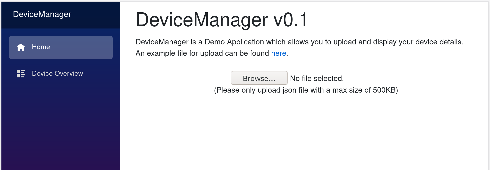
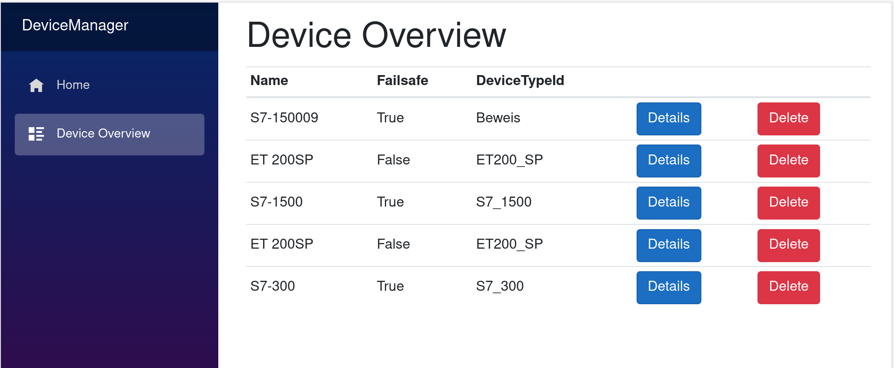
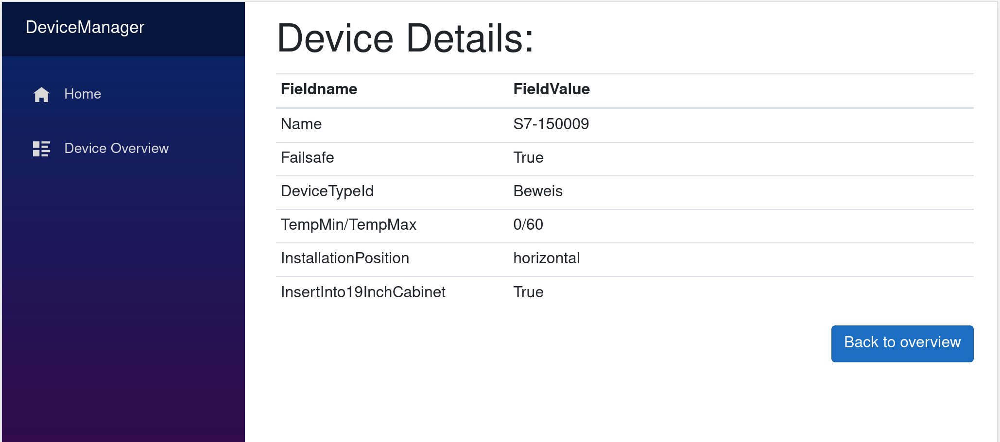

# DeviceManager

A application based on BlazorServer and EFCore which alows to upload files in a certain format which will be important in the database.

## Data example

```json
{
  "devices": [
    {
      "id": "9RLMugEpCVSeemZ5",
      "name": "ET 200SP",
      "deviceTypeId": "ET200_SP",
      "failsafe": false,
      "tempMin": 0,
      "tempMax": 40,
      "installationPosition": "horizontal",
      "insertInto19InchCabinet": true,
      "motionEnable": true,
      "siplusCatalog": false,
      "simaticCatalog": true,
      "rotationAxisNumber": 0,
      "positionAxisNumber": 0,
      "terminalElement": true,
      "advancedEnvironmentalConditions": false
    }
  ]
}
```

## Nice to haves

- Using blazor for the front-end
- Disabling buttons while deleting
- Giving the user feedback about the upload result

## Issues

- No unit-tests
- Not sufficent error handling
- No handling of too big and different file formats

## Todos

- Replace with a real database

## Sreenshots






